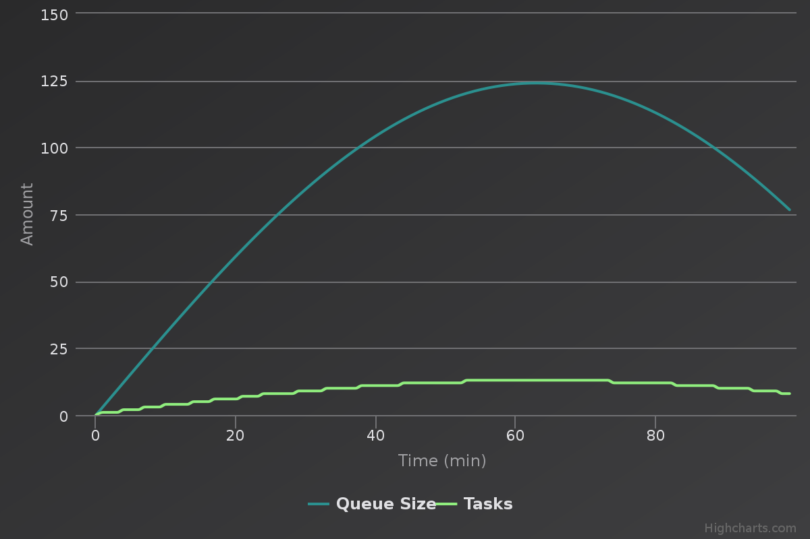
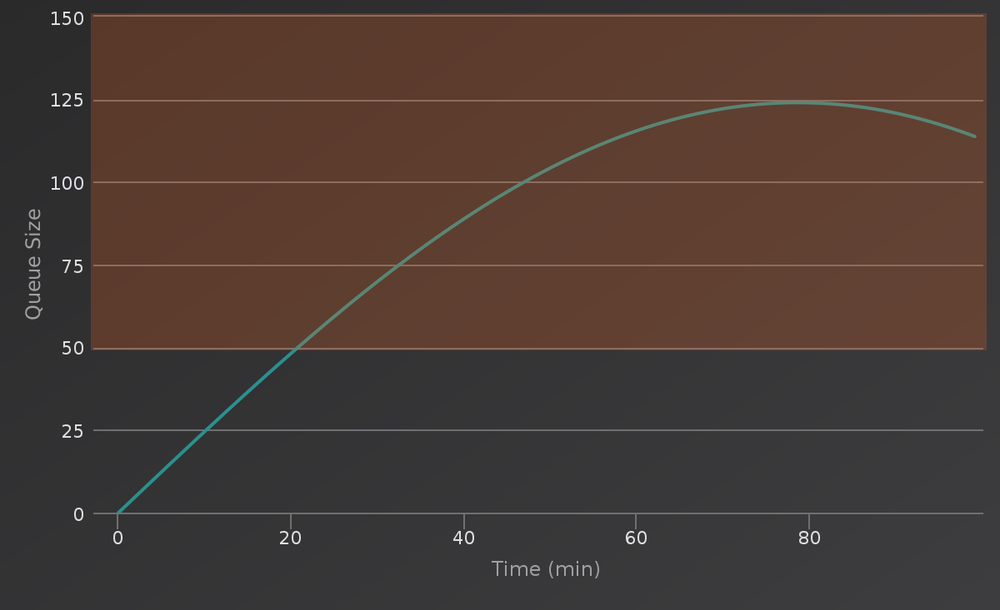
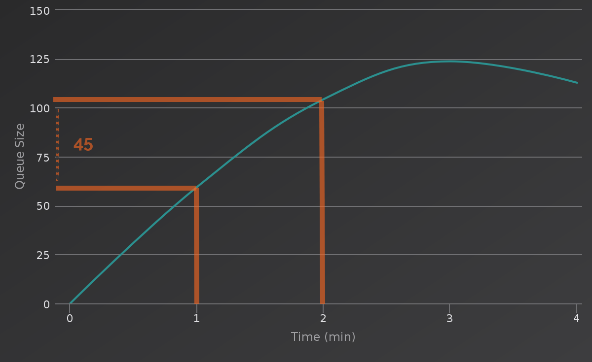

# Autoscale Triggers
An IronWorker that scales up other workers based on IronMQ queue sizes.  You're welcome to fork/extend this repo or create your own.

## Local Testing
If you do not have Go:
```shell
docker run --rm -it -v $PWD:/go/src/a -w /go/src/a -e "CONFIG_FILE=config.json" iron/go:dev sh -c "go get ./... && go run main.go"
```

If you have Go:
```shell
go get github.com/NickSardo/triggers
cd $GOPATH/src/github.com/NickSardo/triggers
export CONFIG_FILE=config.json
go run main.go
```

## Configuration
You can define the configuration in two places:
1.  `scale.json` file located in the same directory as the triggers executable
1.  Visit [hud.iron.io](https://hud.iron.io) and modify the configuration for the dequeuer worker

Configuration from `scale.json` will take priority over configuration from HUD.  

#### Example
```json
{
	"envs": {
		"someQueueEnv":{
    			"token": "AAA",
    			"project_id": "BBB",
                "host": "mq-aws-us-east-1-1.iron.io",
				"api_version": "3"
		},
		"someWorkerEnv":{
    			"token": "AAA",
    			"project_id": "CCC"
		}
	},
	"alerts": [
			{
			"queueName": "sampleQueue",
			"queueEnv": "someQueueEnv",
			"workerName": "dequeuer",
			"workerEnv": "someWorkerEnv",
			"triggers":[
				{
					"type":"ratio",
					"value": 10
				}
			],
			"cluster":"ABC"
		}
	],
	"cacheEnv":"someWorkerEnv",
	"interval": 10,
	"runtime": 1800
}
```

`envs`: named map of bjects describing different Iron.io environments. See dev.iron.io for more information  
`alerts`: Array of objects, each object connects a queue to monitor and a worker to start   
`queueEnv` or `workerEnv`: these values are found under defined environments above  
`cluster`: tasks for this worker are spawned on this cluster   
`cacheEnv`: this scaler code caches the last known queue size, provide an environment to Iron Cache  
`interval`: polling frequency for checking the queue sizes & launching tasks (optional, default: 10 sec)    
`runtime`: seconds this task will live for (optional, default: 1800 seconds)  

#### Triggers
Triggers will tell the scaler how many tasks to spawn.  Given more than one trigger to an alert object, the max tasks generated among all triggers will be used.

##### `ratio` (recommended)
Have one task queued or running for every {value} messages on the queue.

Example:   
Given a ratio value of 10, `# of tasks = queue size / 10`


##### `fixed`
If the queue size >= {value}, have at least one task queued or running.

Example:  
Given a fixed value of 50, have at least one task queued or running starting at time = 20 min.


##### `progressive`
If the queue size grows by {value} messages since the last check time, spawn 1 task. Note this is affected by the `interval` parameter.  
Given a progressive value of 20 and a check interval of 1 minute, spawn two tasks.   
`# of tasks created = (current - prev) / 20`  


##### `min`
Maintain a minimum of {value} workers at all times.  


## Deploying to IronWorker
The following process describes one way to deploy your code to IronWorker - bundling the executable (and config file) into a docker image.  Another option is to zip your files and run `iron worker upload -zip myZip.zip -name triggers iron/base`

If you want to skip compiling the code yourself, you can go to step 3 and use `nicksardo/triggers:0.1`

##### 1. Build this executable
```shell
docker run --rm -it -v $PWD:/go/src/a -w /go/src/a iron/go:dev sh -c "go get ./... && go build -o triggers"
```

##### 2. Build dockerfile and push to your docker registry
If you're using `scale.json`, modify the enclosed Dockerfile to `ADD` the file during image build.
```shell
docker build -t {{youraccount}}/triggers:0.1 .
docker push {{youraccount}}/triggers:0.1
```

##### 3. Test again by creating a config file and running your docker image
```shell
vi someConfig.json  # create a config file called "someConfig.json" in an empty directory
docker run --rm -it -e "CONFIG_FILE=someConfig.json" -v $PWD:/app {{youraccount}}/triggers
```
Specifying the environment variable `CONFIG_FILE` isn't necessary if you built the image with `scale.json`.  

##### 4. Register your docker image with Iron.io
```shell
# Upload
iron register {{youraccount}}/triggers:0.1
```

##### 5. Set configuration data
Visit [hud.iron.io](https://hud.iron.io) and modify the configuration for the `nicksardo/triggers` code package.

##### 6. Schedule task every 30 minutes
```
# Schedule this to run every 30 minutes via CLI or HUD
iron worker schedule -cluster default -run-every 1800 {{youraccount}}/triggers
```
